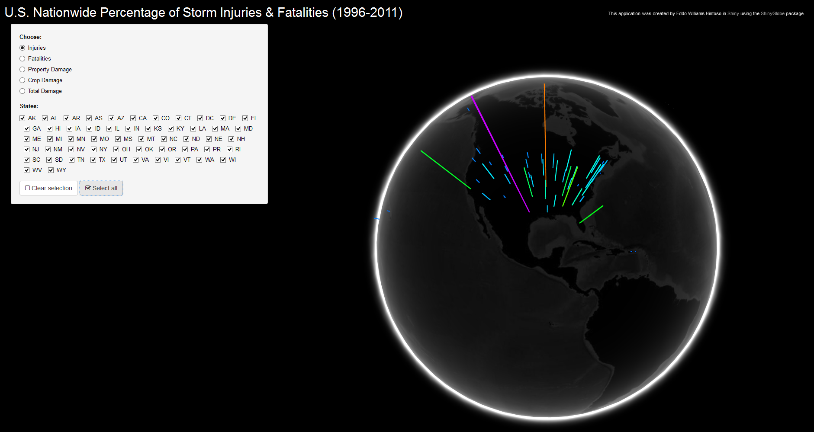

Developing Data Products Course Project
========================================================
author: Eddo Hintoso
date: September 24, 2015

Data
========================================================

- Taken [U.S. National Oceanic and Atmospheric Administration’s (NOAA) storm database](https://www.ncdc.noaa.gov/stormevents/)
- Reported the percentage of injury/fatalities/economic damage each state sustained
- Storm data from 1996 to 2011 was used, in order to minimize bias due to limited data being collect in previous years
    - Using recent data also minimized the effects of inflation on the cost of the damage due to the events.
- [.csv file download](https://d396qusza40orc.cloudfront.net/repdata%2Fdata%2FStormData.csv.bz2)

Shiny App
========================================================

- Utilized [`shinyGlobe`](https://github.com/trestletech/shinyGlobe) package (not on CRAN)
    - *"... an integration of RStudio's Shiny with Google's WebGL Globe platform."*"
    - A [Live Demo](http://spark.rstudio.com/trestletech/globePopulation/) is available at <http://spark.rstudio.com/trestletech/globePopulation/.>
- Takes a `.Rds` formatted data with latitude and longitude columns and returns a numeric value of a third column, based on proportion


```r
head(readRDS("./percent_injury.Rds"), 1)
```

```
  State Latitude Longitude    Percent
1    AK   61.385 -152.2683 0.01808664
```

Available User Inputs
========================================================

- Choose between viewing percentage of injuries, fatalities, total property damage, total crop damage, or total economic damage (property + crop)
- Select any of the 50 states + 4 other districts/territories
- Globe output reacts instantenously to user input

Example of Graphical Output
========================================================




